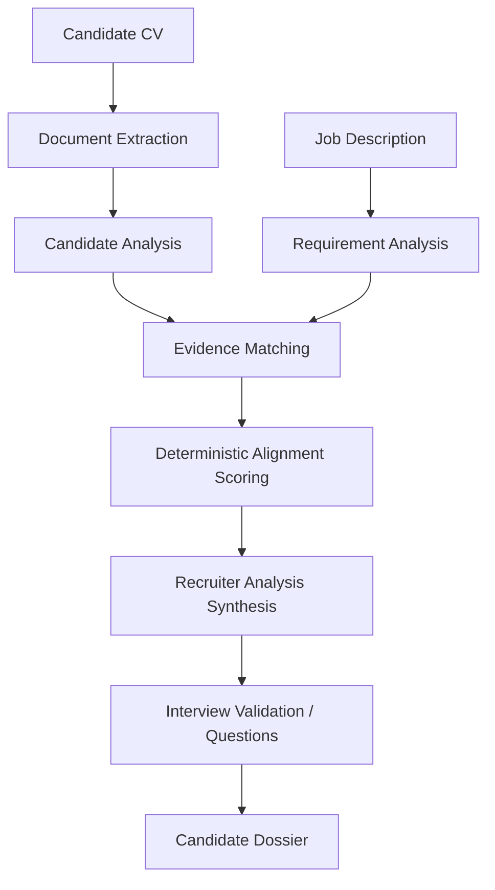

# HireLens AI

**HireLens AI** is an evidence-grounded AI recruitment decision-support application. It analyzes a candidate's CV against a job description and produces a structured, traceable breakdown of how the candidate's documented experience aligns with each stated requirement — including a deterministic alignment score, an LLM-synthesized recruiter analysis, and interview validation areas — without ever making the hiring decision itself.

*Status: AI-powered decision-support prototype, built as a portfolio/demonstration project.*

## Overview

A recruiter uploads a candidate's CV (PDF or DOCX) and pastes a job description. HireLens extracts and structures both documents, matches the candidate's evidence against every stated requirement, computes a deterministic alignment score, and synthesizes a recruiter-facing analysis — strengths, gaps, and areas to verify in an interview. Every claim is traceable back to explicit evidence in the submitted documents.

## The Problem

Recruiters often need to manually compare CVs against detailed job requirements — reading through each resume, cross-referencing it against a list of required and preferred qualifications, and noting what is and isn't supported. This process can be time-consuming and inconsistent, especially across multiple candidates or lengthy job descriptions, and it's easy to lose track of exactly which requirement a piece of evidence was meant to support.

## The Solution

HireLens structures that comparison instead of automating it away. It extracts a candidate profile and a set of job requirements into consistent schemas, matches evidence to each requirement individually, and computes a transparent alignment score from that evidence using fixed, inspectable logic — not an opaque LLM guess. An LLM then synthesizes the resulting evidence into a readable recruiter analysis, grounded strictly in what was already matched. The result is a consistent, evidence-traceable starting point for a recruiter's own review — not a replacement for it.

## Key Features

- CV/resume document extraction (PDF, DOCX)
- LLM-based candidate profile structuring (skills, experience, education, projects, certifications)
- LLM-based job description / requirement extraction (required, preferred, or unclear importance)
- Evidence-grounded requirement matching (deterministic keyword matching first, LLM-based semantic matching as a fallback)
- Deterministic, code-computed alignment score (0–100)
- LLM-synthesized recruiter analysis (summary, strengths, gaps, validation areas)
- Requirement-by-requirement evidence breakdown, with confidence and supporting excerpts
- Evidence coverage summary grouped by requirement importance
- Interview validation areas and per-requirement interview question suggestions
- JSON export of the full analysis dossier
- Human-in-the-loop decision support throughout — no automated hiring decision

## How HireLens Works



This is the actual pipeline executed by `HireLensPipeline.analyze()`: document extraction → candidate analysis → job description analysis → evidence matching → deterministic alignment scoring → LLM recruiter analysis → interview question generation. Every stage's output is a validated Pydantic model, and a failure at any stage stops the pipeline with a clear, traceable error rather than silently producing a partial result.

## Architecture

- **Streamlit UI** (`app.py`) — file upload, job description input, and the recruiter-facing results view.
- **Document extraction** (`src/extraction/document_extractor.py`) — converts an uploaded PDF/DOCX into plain text; never raises for ordinary problems (missing file, unsupported type, corrupted document) — failures are reported via the extraction result itself.
- **Candidate analyzer** (`src/services/candidate_analyzer.py`) — LLM call that normalizes CV text into a structured `CandidateProfile`.
- **Job description analyzer** (`src/services/jd_analyzer.py`) — LLM call that normalizes JD text into structured `JobRequirements`.
- **Evidence matcher** (`src/services/evidence_matcher.py`) — matches each requirement against the candidate profile: deterministic keyword/phrase matching first, falling back to an LLM semantic-matching call only when deterministic matching is inconclusive.
- **Alignment scorer** (`src/services/alignment_scorer.py`) — pure, deterministic scoring logic; no LLM call, no network access.
- **Recruiter analysis generator** (`src/services/recruiter_analysis_generator.py`) — LLM call that synthesizes the evidence and score into a narrative analysis, with a deterministic template fallback if the LLM call fails.
- **Interview question generator** (`src/services/interview_generator.py`) — LLM-drafted, per-requirement interview questions, with a deterministic template fallback.
- **LLM service** (`src/services/llm_service.py`) — the only module that talks to the Groq SDK directly; every other service depends on this abstraction, not on Groq itself.
- **Pipeline orchestrator** (`src/services/hirelens_pipeline.py`) — wires every stage together and assembles the final `CandidateDossier`.
- **Schemas** (`src/models/schemas.py`) — Pydantic models shared across every stage (`CandidateProfile`, `JobRequirements`, `EvidenceMatch`, `AlignmentScore`, `RecruiterAnalysis`, `InterviewQuestion`, `CandidateDossier`, ...).

## Evidence-Grounded Analysis

HireLens distinguishes explicitly between three evidence states for every requirement:

| Status | Meaning |
|---|---|
| **Evidence Found** | The requirement is explicitly supported by content in the submitted documents. |
| **Needs Verification / Partial Evidence** | The available evidence is partial, indirect, or ambiguous. |
| **No Explicit Evidence Found** | No supporting evidence was located in the submitted documents. |

**Absence of evidence in the submitted CV is not evidence that the candidate lacks the skill.** A "no evidence found" result means only that the documents reviewed did not explicitly mention it — never that the candidate is unqualified, incapable, or should be rejected. This distinction is enforced throughout the codebase: the evidence matcher, the alignment scorer, and the recruiter analysis generator are all explicitly instructed (in code and in their LLM prompts) to phrase gaps as "not evidenced in the submitted CV," never as a confirmed absence — and every such gap is surfaced as an area for the recruiter to verify directly with the candidate, typically via the generated interview questions.

## Alignment Score

The alignment score is computed entirely in application code (`AlignmentScorer.score()`) — the LLM is never asked to produce or adjust it.

- **Range:** 0–100, with a descriptive label (`Strong Alignment`, `Moderate Alignment`, `Limited Alignment`, or `Minimal Alignment`) derived from fixed thresholds.
- **Per-requirement credit:** each requirement earns 1.0 credit for `evidence_found`, 0.5 for `needs_verification` (partial credit), and 0.0 for `no_evidence_found` — never a negative penalty, and never treated as proof the candidate lacks the skill.
- **Weighting:** requirements are grouped into a *required* bucket and a *preferred* bucket (preferred and unclear-importance requirements share the lower-weight bucket, since the current schema has no reliable signal to justify a separate third category without guessing). Each bucket's sub-score is the mean credit in that bucket, scaled to 0–100. The overall score is a weighted average: **required requirements = 70%**, **preferred/unclear requirements = 30%**. If one bucket has no requirements, its weight is fully redistributed to the other.
- **This is an alignment indicator, not a prediction.** The score reflects how strongly the candidate's *documented* evidence covers the job's *stated* requirements. It is not a probability of job success, not a ranking against other candidates, and not an automated hiring decision.

## Recruiter Analysis

The recruiter analysis is an LLM-generated narrative (via Groq) that synthesizes the already-computed evidence and alignment score into:

- a **summary** of overall alignment, referencing the fixed score and what it's based on;
- **strengths** — requirements with explicit evidence found;
- **gaps** — requirements not evidenced, or only partially evidenced, phrased as "not evidenced in the submitted CV";
- **validation areas** — the requirements most worth verifying directly with the candidate, prioritized by requirement importance.

The LLM prompt explicitly forbids inventing evidence, adjusting the score, referencing protected characteristics, or stating/implying a hiring decision. If the LLM call fails or returns invalid output, a deterministic template built from the same evidence data is used instead, so this stage never blocks the pipeline. This analysis is meant to speed up a recruiter's review, not replace their judgment.

## Tech Stack

Verified against `requirements.txt` and the actual implementation:

- **Python** 3.10+
- **Streamlit** — web UI
- **Groq API** (`groq` Python SDK) — LLM provider for candidate/JD analysis, semantic evidence matching, recruiter analysis, and interview questions
- **Pydantic** — schema definition and validation for every pipeline stage
- **pypdf** / **python-docx** — PDF and DOCX text extraction
- **python-dotenv** — loads `GROQ_API_KEY` / `GROQ_MODEL` from `.env`
- **pytest** — automated test suite

## Project Structure

```
hirelens-ai/
│
├── app.py                     # Streamlit UI
│
├── src/
│   ├── extraction/
│   │   └── document_extractor.py
│   ├── models/
│   │   └── schemas.py          # Pydantic data models
│   └── services/
│       ├── llm_service.py              # Groq abstraction
│       ├── candidate_analyzer.py
│       ├── jd_analyzer.py
│       ├── evidence_matcher.py
│       ├── alignment_scorer.py         # deterministic scoring
│       ├── recruiter_analysis_generator.py
│       ├── interview_generator.py
│       └── hirelens_pipeline.py        # orchestrates all stages
│
├── tests/                      # pytest suite (fakes/mocks, no real API calls)
├── data/samples/                # sample CV + generator script for manual testing
│
├── test_groq.py                 # manual Groq connection smoke test
├── test_candidate_real.py       # manual real-API smoke tests
├── test_jd_real.py
├── test_pipeline_real.py
│
├── requirements.txt
├── pytest.ini
├── .env.example
└── README.md
```

## Installation

```bash
git clone <this-repository-url>
cd hirelens-ai
```

Create a virtual environment:

**macOS/Linux:**
```bash
python3 -m venv venv
source venv/bin/activate
```

**Windows:**
```bash
python -m venv venv
venv\Scripts\activate
```

Install dependencies:

```bash
pip install -r requirements.txt
```

Configure environment variables:

```bash
cp .env.example .env
```

Then open `.env` and set your Groq API key (get one from the [Groq Console](https://console.groq.com/keys)):

```
GROQ_API_KEY=your-groq-api-key-here
GROQ_MODEL=llama-3.3-70b-versatile
```

`GROQ_API_KEY` is required; `GROQ_MODEL` is optional and defaults to `llama-3.3-70b-versatile` if unset. Never commit your real `.env` file — it's already excluded via `.gitignore`.

## Running the Application

```bash
streamlit run app.py
```

Then, in the browser tab that opens: upload a candidate CV, paste a job description, and click **Analyze Candidate**.

## Testing

```bash
pytest
```

`pytest.ini` scopes test discovery to the `tests/` directory, so the automated suite never makes a real Groq API call — every LLM-backed service is exercised against fakes/mocks. As of this writing, the suite passes with **157 tests**, covering document extraction, every pipeline stage (including the deterministic alignment scorer and the recruiter analysis generator's LLM/fallback paths), schema validation, and full end-to-end pipeline orchestration.

A few root-level scripts (`test_groq.py`, `test_candidate_real.py`, `test_jd_real.py`, `test_pipeline_real.py`) are manual, real-API smoke tests — intentionally excluded from automated discovery since they consume API quota and require a valid `GROQ_API_KEY`. Run them directly (e.g. `python test_groq.py`) only when you want to verify a real Groq connection.

## Example Workflow

1. Upload a candidate CV.
2. Paste a job description.
3. Run analysis.
4. Review the alignment score.
5. Review the recruiter analysis.
6. Review strengths and evidence gaps.
7. Review interview validation areas.
8. Make the final hiring judgment as a human recruiter.

## Responsible AI / Decision Support

- HireLens supports human recruiters — it does not make final hiring decisions.
- Every output is grounded in evidence explicitly present in the submitted documents.
- Missing evidence is never interpreted as proof the candidate lacks a skill; it is reported as "not evidenced" and flagged for verification.
- The alignment score and recruiter analysis are decision support, not a prediction of job success or an automated accept/reject outcome.
- The system does not use or infer protected characteristics (e.g. race, ethnicity, religion, gender, age, disability, marital status, nationality) in any matching, scoring, or analysis.
- Recruiters should independently verify important claims — particularly anything flagged as a gap or needing verification — before making a decision.

## Future Improvements

The following are realistic ideas for future work — none of them exist in the current implementation:

- Support for additional document formats (e.g. plain text, LinkedIn exports)
- Batch analysis of multiple candidates against one job description
- A recruiter dashboard for managing multiple analyses
- Side-by-side candidate comparison views
- Persistent storage of past analyses
- Configurable scoring weights/policies per organization
- Exportable PDF/Word recruiter reports (JSON export exists today)
- Authentication and role-based access control
