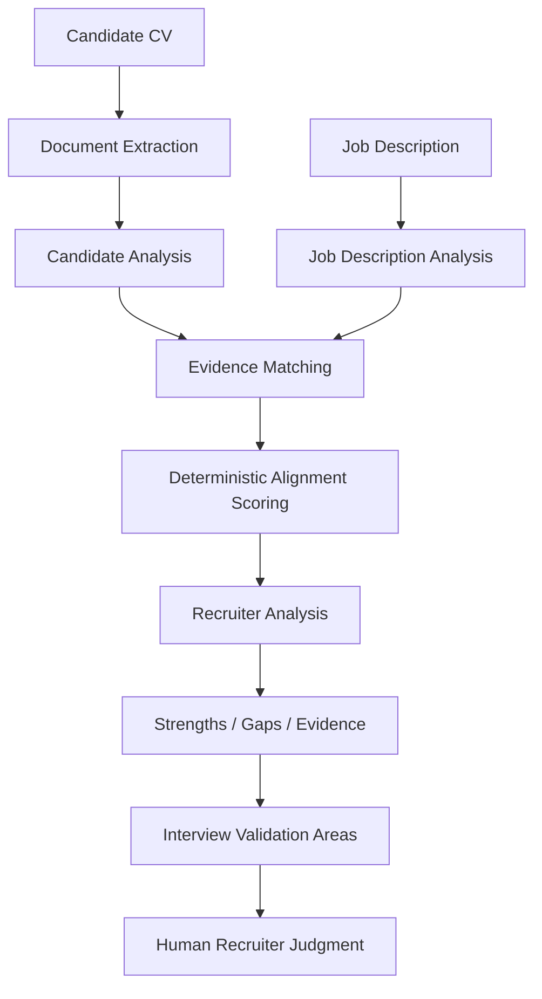

# HireLens AI — Case Study

**Project:** HireLens AI — an evidence-grounded recruiter decision-support system
**Context:** Match Hire / Moss "5-Day Remote AI OS Sprint"
**Status:** Working prototype — built, evaluated, committed, and pushed to GitHub

---

## 1. Executive Summary

Recruiters and hiring teams repeatedly perform the same task: read a candidate's
CV, read a job description, and manually work out which requirements are
supported by the candidate's documented experience, which are unclear, and
which have no evidence at all. This comparison is repeated, independently,
for every candidate screened against every role — with no guarantee that the
same requirement is checked the same way twice.

HireLens AI structures this recurring workflow instead of automating it away.
Given a candidate's CV (PDF or DOCX) and a pasted job description, it extracts
both into structured data, matches the candidate's evidence against every
stated requirement individually, computes a transparent, deterministic
alignment score from that evidence, and has an LLM (via Groq) synthesize the
result into a recruiter-facing narrative — strengths, gaps, and areas worth
verifying in an interview.

**HireLens is recruiter decision support — it is not a hiring decision-maker.**
It never accepts, rejects, ranks, or scores a candidate's fitness for
employment as an outcome. It produces a consistent, evidence-traceable
starting point for a recruiter's own review, and every gap it surfaces is
phrased as "not evidenced in the submitted CV" — never as a confirmed absence
— because missing evidence in a CV is not proof a candidate lacks a skill.
The human recruiter retains every hiring judgment, always.

The design is evidence-grounded (nothing is asserted that isn't traceable to
the submitted documents) and human-in-the-loop by construction (the score is
computed by deterministic code, not by the LLM, and the recruiter is the only
party who ever makes a hire/no-hire call).

---

## 2. The User and the Recurring Problem

**Target user:** Recruiters or hiring-team members who repeatedly review
candidate CVs against job descriptions — the kind of screening pass that
happens for every candidate, for every open role, on an ongoing basis.

**The recurring workflow:**

1. Receive a candidate's CV.
2. Review the candidate's information.
3. Read the job description.
4. Compare the candidate's documented evidence against each stated
   requirement.
5. Identify what's clearly supported, what's unclear, and what's missing.
6. Document those findings (informally — memory, a notes doc, an ATS
   free-text field).
7. Prepare interview questions to verify what's unclear or unsupported.
8. Retain final judgment — the recruiter, not any tool, decides whether to
   move the candidate forward.

**Why this is operationally expensive when repeated:** the manual version of
this workflow (documented in [`evaluation/baseline.md`](../evaluation/baseline.md))
has no structural guarantee that the same requirement is checked the same way
across candidates — it depends on the recruiter's memory, note-taking habits,
and how carefully each CV happens to be read on a given pass. Across many
candidates and many roles, this repetition is where consistency erodes and
where evidence-gathering becomes uneven, even though no single review is
necessarily done poorly.

**What is explicitly not claimed here:** this case study does not assert a
measured number of recruiter-hours consumed by this workflow, a measured
company cost, or a measured time savings from using HireLens. None of those
have actually been collected (see §7 and §10) — `evaluation/baseline.md`
is explicit that "time per candidate review" is **not yet measured** for
either the manual baseline or HireLens, and this case study follows that same
rule rather than inventing a number for narrative effect.

---

## 3. The Existing Workflow and Bottleneck

| Stage | Description |
|---|---|
| **Trigger** | A candidate applies, or a recruiter sources a candidate, for an open role. |
| **Input** | The candidate's CV (a document) and the role's job description (text). |
| **Judgment** | The recruiter reads both and mentally (or in a scratch document) maps CV evidence to JD requirements — deciding what's supported, unclear, or missing. |
| **Tools** | Typically none beyond the CV file, the JD text, and the recruiter's own notes/ATS free-text field — per `evaluation/baseline.md`, the manual baseline uses no structured requirement-by-requirement tool. |
| **Approval** | Implicit — the recruiter's own judgment; no second-party sign-off is described in the baseline. |
| **Output** | Informal notes on strengths/gaps, and ad hoc interview questions, "usually from general experience or a generic template, not systematically derived from the specific gaps in this candidate's specific CV" (`evaluation/baseline.md`). |
| **Exceptions** | Nothing is stated in the baseline for how illegible CVs, unusual formats, or ambiguous requirement wording are handled — these are simply absorbed into the recruiter's own judgment call each time. |

**What is a measured fact vs. an assumption vs. a proposed future metric,**
per `evaluation/baseline.md`:

- **Measured fact:** none of the timing numbers below have actually been
  measured. `evaluation/baseline.md` states this plainly for "time per
  candidate review": *"Not yet measured — no timed manual-review sessions or
  timed HireLens sessions with a human recruiter have been conducted."*
- **Assumption (not a timed study):** the 7-step manual workflow above is a
  workflow *description*, not an observed/timed study of real recruiters.
- **Observed from the codebase (structural fact, not a user study):**
  HireLens is structurally guaranteed to produce one `EvidenceMatch` per
  requirement, every time (`src/services/evidence_matcher.py`); the manual
  baseline has no such structural guarantee.
- **Proposed future metric, not yet collected:** the fraction of
  requirements flagged `needs_verification` per candidate, and a controlled,
  timed comparison of manual vs. HireLens-assisted review (see
  `evaluation/baseline.md`'s "What would be required to responsibly measure
  'time per candidate review'" section, and §12 below).

No performance improvement number is claimed in this case study beyond what
is stated above, because none has actually been measured.

---

## 4. The System We Built

HireLens is a repeatable pipeline, not a single-shot chatbot prompt. Every
run executes the same fixed sequence of stages, each producing a validated,
structured output that the next stage consumes — this is the actual pipeline
executed by `HireLensPipeline.analyze()`
(`src/services/hirelens_pipeline.py`):

**Role of each stage, grounded in the actual code:**

- **Document Extraction** (`src/extraction/document_extractor.py`) — converts
  an uploaded PDF/DOCX into plain text using `pypdf` / `python-docx`. Never
  raises for ordinary problems (unsupported type, missing file, corrupted
  document); it returns an `ExtractedDocument` with `extraction_success` and
  a human-readable `error_message` instead.
- **Candidate Analysis** (`src/services/candidate_analyzer.py`) — an LLM call
  (via Groq) that normalizes raw CV text into a structured `CandidateProfile`
  (skills, experiences, education, projects, certifications), validated
  against a Pydantic schema.
- **Job Description Analysis** (`src/services/jd_analyzer.py`) — an LLM call
  that normalizes JD text into structured `JobRequirements`, each classified
  as `required`, `preferred`, or `unclear` importance.
- **Evidence Matching** (`src/services/evidence_matcher.py`) — matches each
  requirement against the candidate profile: **deterministic keyword/phrase
  matching first**; only when that is inconclusive does it fall back to an
  LLM semantic-matching call, and even then it verifies the LLM's cited
  evidence is actually present (verbatim, case-insensitive) in the supplied
  candidate context before accepting it — otherwise the result is downgraded
  to `needs_verification` rather than trusted at face value.
- **Deterministic Alignment Scoring** (`src/services/alignment_scorer.py`) —
  pure application code, no LLM call, no network access (see §5).
- **Recruiter Analysis** (`src/services/recruiter_analysis_generator.py`) —
  an LLM call that synthesizes the already-computed evidence and score into a
  narrative: summary, strengths, gaps, and validation areas — with a
  deterministic template fallback if the LLM call fails or returns invalid
  output.
- **Strengths / Gaps / Evidence** — the requirement-by-requirement
  `EvidenceMatch` breakdown plus the `RecruiterAnalysis`'s strengths/gaps
  lists, all traceable back to the source documents.
- **Interview Validation Areas** (`src/services/interview_generator.py`) —
  LLM-drafted, per-requirement interview questions (again with a
  deterministic template fallback), prioritized toward what's unclear or
  unsupported.
- **Human Recruiter Judgment** — the pipeline's output is a
  `CandidateDossier`; no stage of the pipeline ever produces a hire/no-hire
  outcome. That judgment happens entirely outside the system, by the
  recruiter.

A failure at any stage stops the pipeline with a single, clearly-typed
`HireLensPipelineError` (with the original exception preserved as its
`__cause__`) rather than silently producing a partial or corrupted result —
see §5's "Graceful degradation" for where recovery instead of failure is the
designed behavior.

---

## 5. Architecture and Major Engineering Decisions

### Evidence-grounded analysis

Every LLM-backed stage is explicitly instructed — in code and in its
prompts — to synthesize only what is present in the submitted documents, and
never to invent a skill, employer, degree, certification, or years of
experience. HireLens distinguishes three evidence states for every
requirement (`EvidenceStatus` in `src/models/schemas.py`):
`evidence_found`, `needs_verification` (partial/ambiguous evidence), and
`no_evidence_found`. The schema's own docstring states the rule explicitly:
*"`no_evidence_found` means no explicit supporting evidence was identified in
the submitted document(s). It must never be interpreted, anywhere
downstream, as proof that a candidate lacks a given skill."* This is enforced
end-to-end: the Evidence Matcher, the Alignment Scorer, and the Recruiter
Analysis Generator are all instructed to phrase gaps as "not evidenced in the
submitted CV," never as a confirmed absence.

### Deterministic alignment scoring

The alignment score is computed **entirely by `AlignmentScorer.score()`**
(`src/services/alignment_scorer.py`) — pure application logic, no LLM call,
no network access. The LLM is never asked to produce or adjust this number.
Concretely:

- Each requirement earns a fixed credit from its `EvidenceMatch` status:
  **1.0** for `evidence_found`, **0.5** for `needs_verification`, **0.0** for
  `no_evidence_found` — never a penalty below zero, and zero credit is never
  treated as a claim that the candidate lacks the skill.
- Requirements are grouped into a **required** bucket and a
  **preferred/unclear** bucket (preferred and unclear-importance requirements
  share the lower-weight bucket, because — per the module's own docstring —
  the current schema has no reliable, non-invented signal to justify a
  separate third category without guessing).
- Each bucket's sub-score is the mean credit in that bucket, scaled to 0–100.
  The overall score is a weighted average: **required = 70%**,
  **preferred/unclear = 30%**. If one bucket is empty, its weight is fully
  redistributed to the other.
- The result is an integer in `[0, 100]` with a label from four fixed bands
  (`Strong` ≥85, `Moderate` ≥60, `Limited` ≥35, `Minimal` below that).

This is a deliberate trade-off: a deterministic score is fully reproducible
(same input → same score, always) and fully inspectable (`methodology_note`
on every `AlignmentScore` explains exactly how it was computed), at the cost
of not capturing any nuance an LLM might otherwise "feel" about a borderline
case. That trade-off is intentional — the score is explicitly documented as
"an alignment indicator, not a prediction... not a probability of job
success... not an automated hiring decision."

### Groq LLM integration

`src/services/llm_service.py` is the **only** module that imports the Groq
SDK directly; every other service depends on this one internal abstraction
(`generate_text(prompt, system_instruction=None)`), not on Groq itself. Groq
is used for every language-understanding stage: candidate profile
normalization, job description analysis, semantic evidence-matching fallback,
recruiter analysis synthesis, and interview question generation. Per
`evaluation/failure_analysis.md` and git commit `fd6f623` ("Migrate LLM
provider to Groq; add deterministic alignment scoring and recruiter
analysis"), HireLens originally used Google's Gemini API during development;
Gemini's free-tier quota was exhausted (HTTP 429 / `RESOURCE_EXHAUSTED`),
which blocked the workflow entirely whenever it happened. The project
migrated to Groq, preserving the same `generate_text` interface so every
downstream service required no change beyond the service rename
(`GeminiLLMService` → `GroqLLMService`). This same provider-isolation design
is *why* that migration was a single-module change rather than a rewrite —
and the failure analysis is explicit that this "did not make provider
failure impossible" (Groq has its own rate limits and can fail too) — it
made the *handling* of provider failure explicit, typed
(`LLMQuotaExceededError`, `LLMAuthenticationError`, `LLMInvalidModelError`,
`LLMConnectionError`), and provider-agnostic at the boundary.

### Structured outputs and schema validation

Every stage's output is a Pydantic model (`src/models/schemas.py`):
`CandidateProfile`, `JobRequirements`, `EvidenceMatch`, `AlignmentScore`,
`RecruiterAnalysis`, `InterviewQuestion`, and the final `CandidateDossier`
that combines them all. Every LLM response is validated against its schema
before it can flow further into the pipeline — an LLM that returns malformed
JSON or a shape that doesn't validate is treated as a failure at that stage,
not silently accepted. This matters because it is what lets the rest of the
pipeline (scoring, downstream consumers, the UI) rely on a guaranteed shape
rather than defensively re-checking arbitrary LLM output at every use site.

### Human decision boundary

No stage of HireLens states or implies a hire/no-hire outcome. The
`AlignmentScore` and `RecruiterAnalysis` docstrings both say this explicitly:
they are decision *support* for a human recruiter's own judgment, never a
hiring decision themselves. The LLM prompt for recruiter analysis explicitly
forbids inventing evidence, adjusting the score, referencing protected
characteristics, or stating/implying a hiring decision. The recruiter always
makes the final call — the pipeline's terminal output is a dossier, not a
verdict.

### Graceful degradation

Two stages have a documented, code-verified deterministic fallback: the
**Recruiter Analysis Generator** and the **Interview Question Generator**
each fall back to a template built directly from the already-computed
evidence/score data if the LLM call fails or returns invalid output — so a
single bad or unavailable LLM response at these later stages never blocks
the pipeline (`evaluation/failure_analysis.md` §3). By contrast, **Candidate
Analysis** and **Job Description Analysis** are normalization tasks with no
safe deterministic fallback (there is no reasonable "template" candidate
profile), so a failure there raises and stops the pipeline with a clear
error rather than silently accepting a wrong or empty result. This is a
deliberate, tiered strategy — fail fast where there's no safe fallback,
degrade gracefully where there is — not a uniform policy.

---

## 6. Scope Decisions and Explicit Non-Goals

HireLens intentionally does **not**:

- **Hire candidates automatically.** No stage of the pipeline produces an
  accept/reject/hire outcome; the final `CandidateDossier` contains
  evidence, a score, and a narrative — never a decision.
- **Reject candidates automatically.** The same boundary applies in both
  directions; a low alignment score is a description of documented
  evidence coverage, not an automated rejection.
- **Claim certainty about undocumented qualifications.** Every generated
  claim must be traceable to the submitted documents; nothing is invented
  to fill a gap.
- **Treat missing evidence as proof a candidate lacks a skill.**
  `no_evidence_found` is phrased everywhere as "not evidenced in the
  submitted CV" — the schema, scorer, and analysis generator are all
  written and instructed to preserve this distinction, never collapsing it
  into a confirmed absence.
- **Replace human recruiter judgment.** The recruiter is the only party
  that ever makes a hiring decision; HireLens produces a structured,
  evidence-grounded starting point for that judgment, not a substitute
  for it.
- **Evaluate protected characteristics.** Nothing in the schemas
  (`CandidateProfile`, `JobRequirements`, etc.) carries race, ethnicity,
  religion, gender, age, disability, marital status, or nationality —
  there is structurally nothing here for scoring or analysis to use or
  infer, and the recruiter-analysis prompt additionally forbids referencing
  them.

These boundaries matter because a recruiting tool that quietly drifts into
making — or appearing to make — a hiring decision would misrepresent both
its own reliability and the legal/ethical responsibility that belongs with a
human decision-maker. Keeping the system's claims strictly scoped to "what is
documented, and how it maps to what was asked for" is what makes its output
trustworthy enough to actually hand to a recruiter.

---

## 7. Evaluation Strategy

The [`evaluation/`](../evaluation/) package is a separate deliverable from
the unit/integration test suite (`tests/`, 157 tests, pytest-scoped, fakes/
mocks only, no real API calls). It evaluates end-to-end *product* behavior
against **12 test cases** covering recruiting-workflow scenarios, reusing
the real pipeline and schemas rather than reimplementing them.

Each case runs in one of three explicit **modes**, so cost and quota
concerns are always controllable:

- **`deterministic`** (4 cases: TC-04, TC-06, TC-08, TC-11) — pure
  application code, no LLM constructed at all. Free, instant, always safe.
- **`mocked`** (4 cases: TC-05, TC-07, TC-09, TC-12) —
  the real pipeline/service classes wired to a scripted fake LLM service
  (canned responses) or a fake that deliberately raises a provider-style
  error. No network call.
- **`live`** (4 cases: TC-01, TC-02, TC-03, TC-10) — the real
  `HireLensPipeline` wired to the real `GroqLLMService`, making real Groq
  API calls. Only runs with explicit `--yes` opt-in, after the planned call
  count is shown.

This is not a case of "all tests are the same kind dressed up differently" —
the mode split is a deliberate design choice so that free, fast checks
(deterministic + mocked) can run on every commit at zero cost, while live
model behavior is verified deliberately and separately, since it consumes
real API quota.

**Supporting artifacts, all grounded in the actual repository:**

- [`evaluation/rubric.md`](../evaluation/rubric.md) — six explicit
  criteria (evidence grounding, requirement classification, score behavior,
  error handling, output completeness, human decision boundary), each
  mapped to the specific test cases that check it.
- [`evaluation/baseline.md`](../evaluation/baseline.md) — the manual-review
  workflow comparison, with measured/assumption/not-yet-measured explicitly
  labeled (see §3).
- [`evaluation/failure_analysis.md`](../evaluation/failure_analysis.md) —
  five documented failure scenarios (the historical Gemini→Groq migration,
  three reproduced failure modes, and the live TC-10 bug — see §9).
- [`evaluation/results.json`](../evaluation/results.json) — machine-readable
  results, regenerated by `run_evaluation.py`, never hand-edited.
- [`evaluation/results.md`](../evaluation/results.md) — the human-readable
  rendering of the same results, plus a "Prepared but not yet executed"
  section so it's always clear what has and hasn't actually been run.

Explicit pass/fail criteria for every case (e.g. "`overall_score >= 65`",
"pipeline completes without raising `HireLensPipelineError`") are defined in
[`evaluation/test_cases.json`](../evaluation/test_cases.json) and checked by
`run_evaluation.py` — nothing is graded by inspection alone.

---

## 8. What We Deliberately Tried to Break

The evaluation package was built to find failure conditions, not just to
demonstrate a happy path. The 12 cases, as actually defined in
`evaluation/test_cases.json`, deliberately cover:

- **Strong alignment** (TC-01) — a candidate with evidence for nearly all
  required and preferred qualifications.
- **Moderate alignment** (TC-02) — a candidate matching some major
  requirements but with meaningful, realistic gaps (no Docker, no
  AWS/Kubernetes, no CS degree, a different database technology).
- **Low documented alignment** (TC-03) — a candidate whose CV supports few
  or none of the stated requirements.
- **Missing required-skill evidence** (TC-04) — the deterministic
  no-evidence path.
- **Ambiguous / partial evidence** (TC-05) — evidence that's related but
  not conclusive, forcing the `needs_verification` path.
- **Preferred qualifications missing** (TC-06) — verifying that missing
  *preferred* items don't crater the score the way missing *required*
  items do.
- **Sparse / minimal CV** (TC-07) — a CV with very little content at all.
- **Invalid or unsupported document input** (TC-08) — wrong file type,
  missing file, corrupted document.
- **LLM / provider service failure** (TC-09) — simulated quota-exceeded and
  connection failures.
- **Input formatting variation** (TC-10) — the same underlying role
  expressed as dense prose with synonyms, against a CV with no
  conventional section headers.
- **Empty input validation** (TC-11) — empty/whitespace-only CV or JD text,
  checked to short-circuit *before* any LLM call is made.
- **Full dossier structural completeness and decision-boundary check**
  (TC-12) — verifying every expected section exists and no forbidden
  hiring-decision phrase appears anywhere in the output.

The goal throughout was to find where the system breaks, not merely to show
it working on a clean input — and, per §9, it did find a real bug.

---

## 9. A Real Failure We Found and Fixed

**TC-10 (Input variation)** ran a candidate CV written as dense prose, with
no `"Job Title — Company"` heading — e.g. *"Prior role at Fenwick Data
(2020-present) where day-to-day work included API development..."* — against
a prose-style rewrite of the job description. This is a realistic, honest
input-format variation: many real CVs (career-change narratives, contract/
freelance work, prose-style resumes) describe work experience without ever
stating a conventional job title.

**What happened:** Groq correctly followed its own grounding instructions
("do not infer, omit rather than guess") and returned `"role": null` for both
experience entries, since no title was stated anywhere in the CV. But
`CandidateExperience.role` in `src/models/schemas.py` was declared as a
**required, non-nullable** string — the only required field in
`CandidateExperience` (every sibling field was already optional). Pydantic
validation rejected the null value, `CandidateAnalyzer` raised, and the
entire pipeline failed for an entirely realistic CV.

**Root-cause confirmation:** `src/services/evidence_matcher.py` already
guarded `if experience.role and experience.role.strip()` before using the
field — the rest of the codebase was already written assuming `role` could
be falsy/`None`. This confirmed the required-field constraint was an
unintentional oversight, not a deliberate invariant.

**The fix, exactly as applied (no unrelated changes):**

1. `src/models/schemas.py` — `CandidateExperience.role` changed from
   required `str` to `str | None = None`, matching every sibling field.
2. `src/services/candidate_analyzer.py` — the prompt's documented JSON shape
   for `"role"` changed from `string` to `string or null`, so the LLM's
   instructions now match what the schema actually accepts.

**Before → after, measured (from `evaluation/results.md` and
`evaluation/failure_analysis.md`):**

| | Before fix | After fix |
|---|---|---|
| TC-10 live run | **ERROR** (2.82s) — `HireLensPipelineError: Candidate analysis failed: The LLM's response did not match the expected candidate profile structure.` | **PASS** (59.56s) — `overall_score=72`, `alignment_label=Moderate Alignment`, all 9 parsed requirements matched, no forbidden phrase |
| Relevant existing tests (`test_models.py`, `test_candidate_analyzer.py`, `test_evidence_matcher.py`, `test_hirelens_pipeline.py`) | — (bug was not caught by the existing suite) | 65 passed, 0 failed |
| Full `pytest` suite | 157 passed | 157 passed (unchanged) |

No pass/fail criterion for TC-10 was loosened to make it pass — the criteria
in `test_cases.json` are unchanged from before the bug was found. This is
exactly the Day 4 "Evaluate, Break, and Harden" process: a live evaluation
run against the real model surfaced a real product bug that 157 passing
mocked/fake unit tests did not, because none of those tests happened to
construct a CV where an experience entry has no stated title.

---

## 10. Results

Only results actually recorded in the repository are reported here.

- **Evaluation status: 12/12 PASS.** Per `evaluation/results.md`
  (last updated 2026-09-05), every one of the 12 test cases — across all
  three modes (deterministic, mocked, live) — currently passes.
- **Automated test suite: 157 tests passing.** Confirmed by running
  `pytest` against the current repository state; this matches the count
  documented in the README and in `evaluation/failure_analysis.md`.
- **Measured execution time per case** (wall-clock pipeline execution,
  from `evaluation/results.md`) — this is machine processing time, **not**
  a recruiter's end-to-end review time:
  - Deterministic cases: 0.0000s–0.0005s.
  - Mocked cases: 0.0002s–0.0234s.
  - Live cases (real Groq calls): 31.7s (TC-01) to 95.5s (TC-03), 82.8s
    (TC-02), 59.6s (TC-10).
- **Regression, before → after** (§9): TC-10 went from **ERROR** (2.82s)
  before the schema fix to **PASS** (59.56s) after it — the only case in
  the "Regression history" table in `results.md`.
- **Baseline comparison limitation:** per `evaluation/baseline.md`, no
  timed manual-review study has been conducted, so there is **no measured
  comparison** between manual review time and HireLens-assisted review
  time. The step-count comparison (7 manual steps vs. 1 HireLens
  interaction) is a workflow description, not a timed observation.

**Explicitly not claimed**, because none of it has been measured or
collected: time saved per candidate, recruiter adoption numbers, cost
savings, an accuracy percentage, or any business impact figure. Where a
metric was not collected, this case study says so rather than substituting
an estimate.

---

## 11. Limitations

- **Missing evidence is not proof of missing ability.** A
  `no_evidence_found` result means the submitted documents didn't mention
  something explicitly — it says nothing about whether the candidate
  actually has that skill. This is a structural limitation of any
  document-based analysis, not something HireLens can resolve on its own;
  it is why every gap is routed to the recruiter as something to verify,
  not treated as a conclusion.
- **LLM interpretation can require validation.** Semantic evidence matching
  (the LLM fallback in `EvidenceMatcher`) and the recruiter-analysis
  narrative are both LLM-generated; while evidence is verified against the
  supplied context before being accepted, wording and framing choices are
  still an LLM's synthesis and benefit from a human read, not a
  rubber-stamp.
- **Document quality affects extraction quality.** Only `.pdf` and `.docx`
  are currently supported (`src/extraction/document_extractor.py`); a
  `.doc`, `.rtf`, plain-text, or LinkedIn-export CV produces a clear
  "unsupported file type" error rather than a best-effort conversion. This
  is a scope limitation, not a bug.
- **The system supports recruiter judgment; it does not replace it.** No
  output is, or is intended to be, sufficient on its own to make a hiring
  decision — every score and narrative is designed to be a starting point
  for a recruiter's own verification.
- **Baseline business metrics have not been collected from production
  usage.** As detailed in §3 and §10, no timed manual-review study and no
  timed HireLens-assisted study have been conducted; the comparison to the
  manual baseline is currently qualitative/structural, not quantitative.
- **Current evaluation uses synthetic, fictional candidate data.** The
  test CVs and JDs in `evaluation/test_data/` are generated fixtures with
  fictional names and employers (per `evaluation/README.md`), not real
  recruiting data — they are well-suited to testing pipeline behavior and
  failure conditions, but they are not a substitute for evaluation against
  real, messy, in-the-wild CVs and job descriptions.
- **The `role` fix (§9) was targeted, not a full schema audit.** It
  resolved the one required field that was inconsistent with its siblings;
  it does not constitute a systematic review of every schema field for the
  same class of issue.

---

## 12. Next Two-Week Iteration Plan

The following is **future work** — none of it is implemented today. It is
scoped to stay consistent with HireLens's existing design (evidence-grounded,
deterministic scoring, human-in-the-loop), not to introduce unrelated
features.

### Week 1 — Learn from real or proxy recruiter usage

- Run HireLens against a small set of real or realistic (anonymized/
  proxy) candidate CVs and job descriptions, with a recruiter or
  recruiter-proxy actually reviewing the output, to start closing the
  "not yet measured" gap identified in `evaluation/baseline.md`.
- Collect structured recruiter feedback on the recruiter analysis and
  interview questions: which strengths/gaps felt useful and accurate,
  which felt off or oddly phrased, and where the "not evidenced" framing
  was or wasn't clear.
- Expand document-format coverage in evaluation (e.g. additional CV
  layouts, lengths, and styles) to surface more issues like the TC-10
  `role` bug before they'd affect a real user.
- Begin tracking false positives/negatives qualitatively — cases where a
  requirement was marked `evidence_found` but a reviewer disagrees, or
  `no_evidence_found`/`needs_verification` where evidence was arguably
  present — to build a concrete list of matching-quality issues rather
  than relying on the current mocked/live test scenarios alone.
- Improve how evidence is presented to the recruiter based on early
  feedback (e.g. clearer linkage between an `EvidenceMatch` excerpt and
  the exact requirement it addresses).

### Week 2 — Act on what Week 1 surfaces

- Prioritize workflow improvements directly informed by Week 1 feedback
  (e.g. clarifying ambiguous phrasing, adjusting how validation areas are
  ordered/prioritized).
- Add new evaluation cases for any failure modes or edge conditions
  discovered during Week 1's real/proxy usage, following the same
  test-case + rubric structure already established in `evaluation/`.
- Usability improvements to the Streamlit UI (`app.py`) based on where
  reviewers got confused or needed information that wasn't visible near
  the score.
- Begin collecting the operational metrics identified as missing in
  `evaluation/baseline.md` — most importantly, a small, timed,
  side-by-side comparison of manual vs. HireLens-assisted review, run
  under comparable conditions, so future claims about time savings can be
  grounded in an actual measurement rather than an assumption.
- Evaluate integration/deployment needs surfaced by real usage (e.g.
  whether recruiters need the JSON export in a different format, or
  whether a specific document format gap from Week 1 is worth adding
  support for).

---

## 13. Key Takeaways

- HireLens targets a genuinely **recurring recruiting workflow** —
  comparing a candidate's CV against a job description's requirements —
  not a one-off task.
- It is built as a **repeatable system**: the same fixed pipeline stages,
  the same schemas, and the same scoring formula run on every candidate,
  rather than an ad hoc prompt improvised per use.
- The **human decision boundary is maintained by design**, not by
  disclaimer alone: no stage of the pipeline produces a hire/no-hire
  outcome, and every gap is phrased as "not evidenced," never as a
  confirmed absence.
- **Deterministic logic is used exactly where reliability matters most** —
  the alignment score is pure application code with no LLM involvement, so
  it is reproducible and fully inspectable, while the LLM is reserved for
  the tasks (normalization, narrative synthesis) that genuinely need it.
- The evaluation strategy was built to **find failures, not just
  showcase a happy path** — 12 cases spanning strong/moderate/low
  alignment, ambiguous evidence, invalid input, provider failure, and
  formatting variation, run across deterministic, mocked, and live modes.
- That evaluation strategy **worked**: a live test case (TC-10) found a
  real product bug — a schema field that was incorrectly required —
  that 157 passing mocked unit tests had not caught, and the fix was
  verified with a measured before/after (ERROR → PASS) rather than
  asserted.
